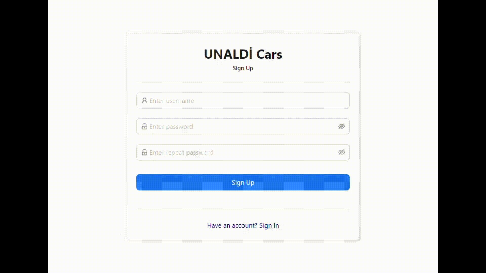
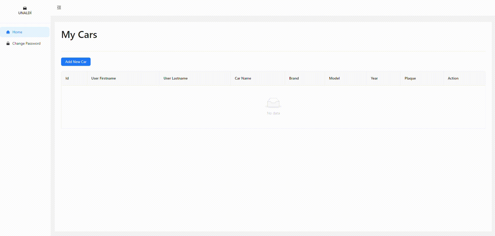
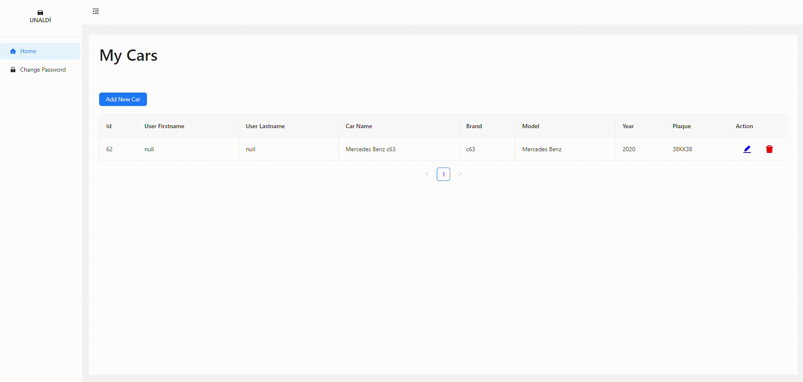

# `Car Registration System`

This React project was bootstrapped with [Vite + React + TypeScript](https://vitejs.dev)
> **Patika.dev** is a 6-month software training graduation project frontend repository

> The project's backend repository developed with **Java Spring Boot**. Click to go to Backend [Car Registration System Api](https://github.com/emre-unaldi/Car-Registration-System-Api)

## `Used Technologies`
- HTML
- CSS
- JavaScript
- TypeScript
- React
    - Redux

## `Used Libraries`
- react
- react-dom
- react-redux
- @reduxjs/toolkit
- react-router-dom
- axios
- antd
- @ant-design/icons

## `Run Application`
Run in project directory :
````shell
npm install
````
````shell
npm run dev
````
Runs the app in the development mode.\
Open [http://localhost:5173](http://localhost:5173) to view it in the browser.

## `Preview`


